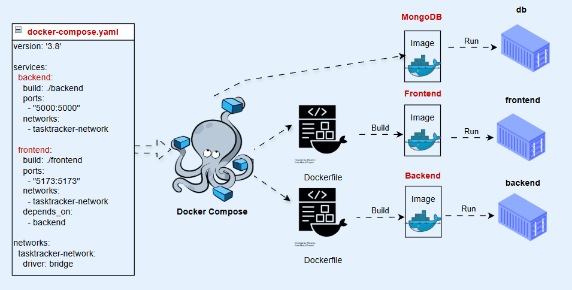
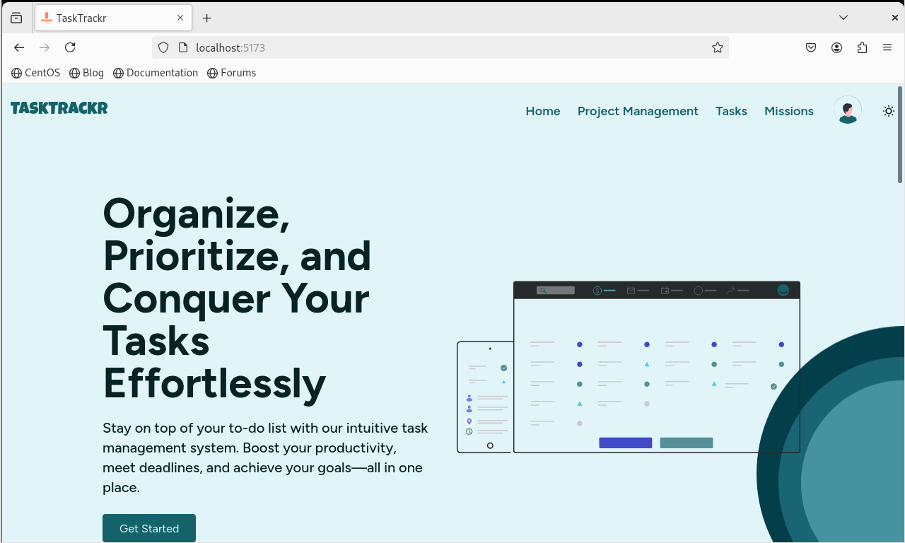

### Dockerized-TaskTracker-Application--ITI

TaskTracker is a modern, Dockerized full-stack task management application built with React.js, Node.js, Express.js, and MongoDB. It allows users to manage tasks, projects, and collaborate efficiently. The application is containerized using Docker and orchestrated with Docker Compose for easy deployment and scalability.



# Getting Started 🚀
Prerequisites

Docker and Docker Compose installed on your machine.

## Setup Instructions
- 1- Clone the Repository:
`git clone https://github.com/youssefahmed8/Dockerized--Full-Stack-TaskTracker-App-ITI.git`

`cd Dockerized--Full-Stack-TaskTracker-App-ITI`
- 2- Run the Application:
Start the application using Docker Compose:
`docker compose up -d`

## Expected output

```bash

[+] Running 3/3
 ✔ Network dockerized--full-stack-tasktracker-app-iti_tasktracker-network  C...                                                                          0.4s 
 ✔ Container dockerized--full-stack-tasktracker-app-iti-backend-1          Started                                                                       4.9s 
 ✔ Container dockerized--full-stack-tasktracker-app-iti-frontend-1         Started                                                                       0.8s 

```

- 3- Access the Application:

Open your browser and go to http://localhost:5173 to use the app. or ex your machine ip "192.168.1.1:5173"

